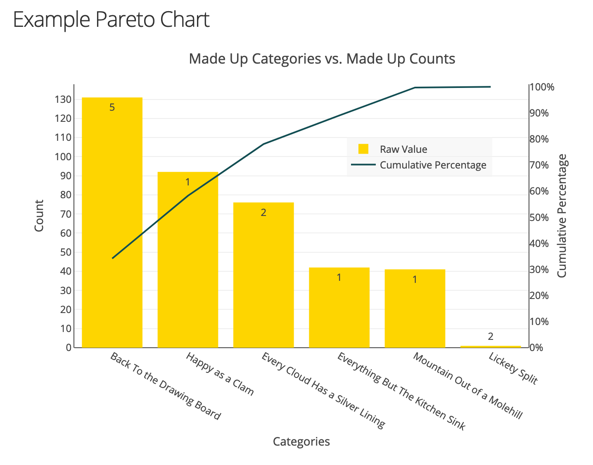
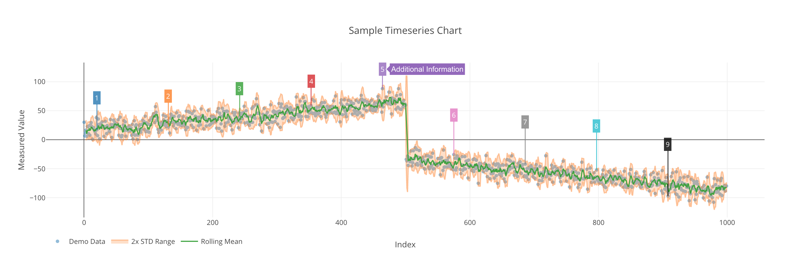
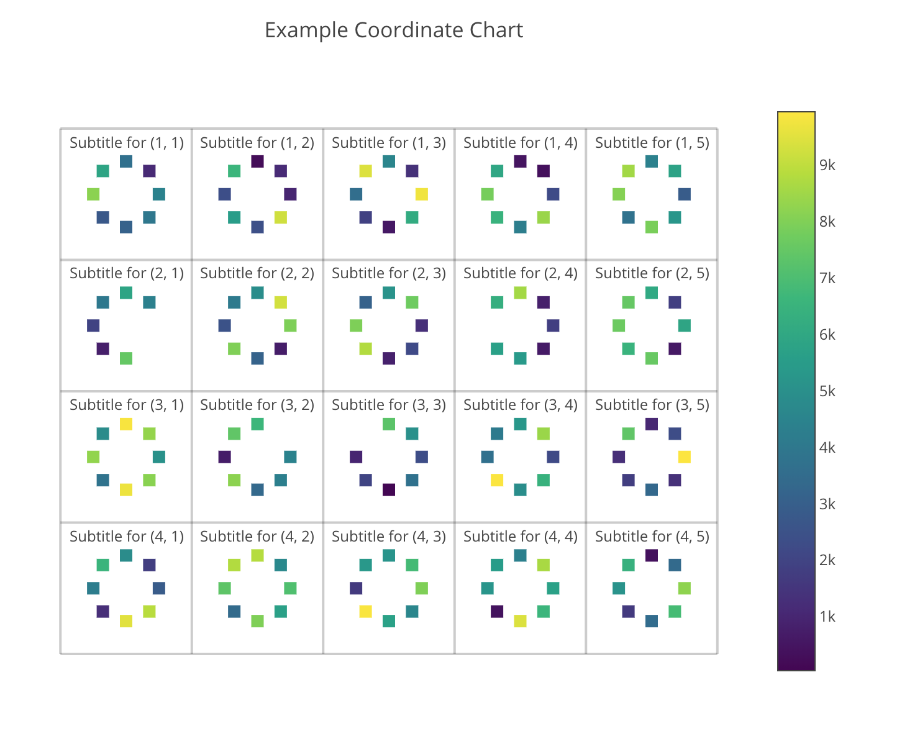
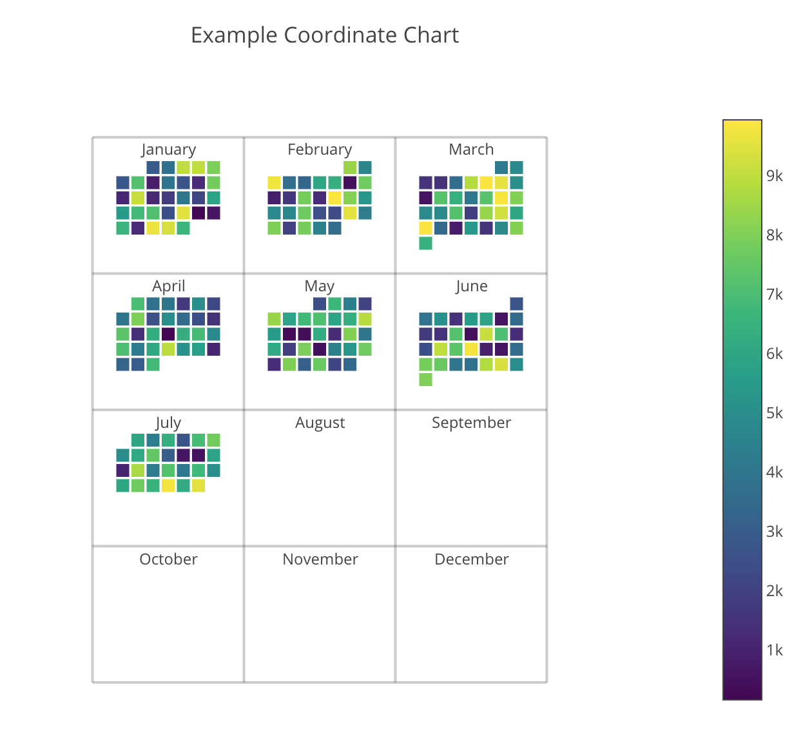
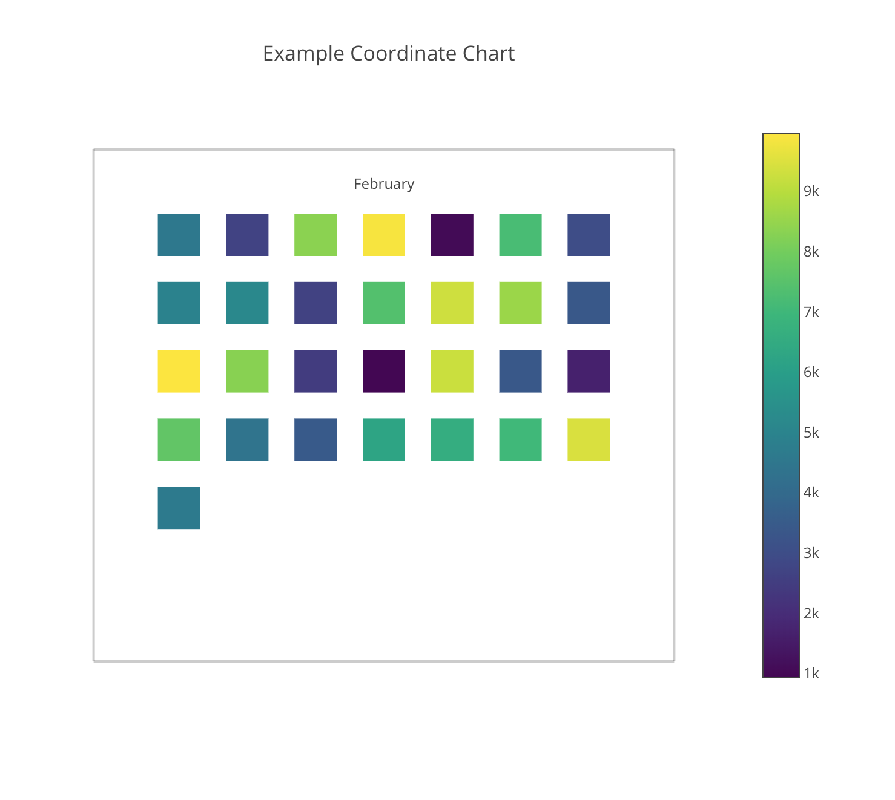
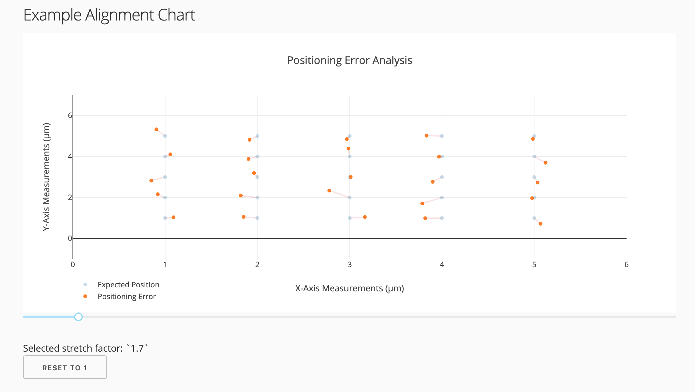
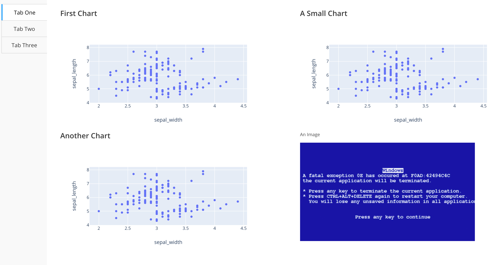

# Dash_Charts

Library for OOP implementation of [Plotly/Dash](https://dash.plot.ly/). Includes base classes for building a custom chart or application, new charts such as a Pareto, and base classes for tabbed or multi-page applications. See full documentation at [https://kyleking.me/dash_charts/](https://kyleking.me/dash_charts/).

<!-- TOC -->

- [Dash_Charts](#dash_charts)
  - [Quick Start](#quick-start)
  - [Local Development](#local-development)
  - [Example Charts and Documentation](#example-charts-and-documentation)
    - [Pareto Chart](#pareto-chart)
    - [Rolling Mean/STD Chart](#rolling-meanstd-chart)
    - [Coordinate Chart](#coordinate-chart)
    - [Alignment Chart](#alignment-chart)
    - [Tabbed Application](#tabbed-application)
  - [External Links](#external-links)
  - [Task List/Action Items](#task-listaction-items)

<!-- /TOC -->

## Quick Start

1. Install `dash_charts` from Github with: pip install git+https://github.com/KyleKing/dash_charts.git` (or in a Poetry project with `pip install dash_charts --git https://github.com/KyleKing/dash_charts.git`)
1. Minimum example:

    ```py
    import dash_html_components as html
    import plotly.express as px
    from dash_charts.pareto_chart import ParetoChart
    from dash_charts.utils_app import AppBase
    from dash_charts.utils_fig import min_graph


    class ParetoDemo(AppBase):
        """Example creating a simple Pareto chart."""

        name = 'Car Share Pareto Demo'
        """Application name"""

        raw_data = None
        """All in-memory data referenced by callbacks and plotted. If modified, will impact all viewers."""

        main_chart = None
        """Main chart (Pareto)."""

        id_chart = 'pareto'
        """Unique name for the main chart."""

        def __init__(self):
            """Initialize app."""
            super().__init__()
            self.raw_data = (px.data.carshare()
                            .rename(columns={'peak_hour': 'category', 'car_hours': 'value'}))
            # self.raw_data =
            self.raw_data['category'] = [f'H:{cat:02}' for cat in self.raw_data['category']]
            self.register_uniq_ids([self.id_chart])

        def register_charts(self):
            """Initialize charts."""
            self.main_chart = ParetoChart(title='Car Share Pareto', xlabel='Peak Hours', ylabel='Car Hours')

        def return_layout(self):
            """Return Dash application layout.

            Returns:
                obj: Dash HTML object. Default is simple HTML text

            """
            return html.Div([
                html.Div([min_graph(
                    id=self.ids[self.id_chart],
                    figure=self.main_chart.create_figure(raw_df=self.raw_data, show_count=True),
                )]),
            ])

        def register_callbacks(self):
            pass  # Override base class. Not necessary for this example


    ParetoDemo().run(debug=True)
    ```

## Local Development

```sh
git clone https://github.com/KyleKing/dash_charts.git
cd dash_charts
poetry install
poetry shell
python examples/ex_px.py
```

## Example Charts and Documentation

Full documentation is available at: [https://kyleking.me/dash_charts/](https://kyleking.me/dash_charts/). Below headers highlight some of the examples and included chart functionality

### Pareto Chart

Create a Pareto chart in Dash. Handles ordering the category, calculating the cumulative percentage, and configuring both YAxis.



### Rolling Mean/STD Chart

Easily chart the rolling mean and standard deviation for a given scatter data set.



### Coordinate Chart

Chart a discrete data set on a 2D plane with color for intensity. Below examples show how to use the `CircleGrid()` and `MonthGrid()` classes





### Alignment Chart

Useful for visualizing misalignment between measured values and expected values. Accepts a `stretch` argument to visually increase the spacing between the measured and expected value.



### Tabbed Application

Use the `AppWithTabs()` base class for quickly building complex applications.



<!-- TODO: Add the multi-page base class -->

## External Links

Useful Dash reference links

- [Official Dash Docs](https://dash.plot.ly)
  - Using [URLs in Dash](https://dash.plot.ly/urls)
- [Official Plotly Docs](https://plot.ly/python/) (Searchable)
- Example Apps
  - Pretty annotations from [Market Ahead](https://www.marketahead.com/p/FOX) commercial Dash app
  - Pleasant dark app from Dash-Bio, [Circos](https://github.com/plotly/dash-bio/blob/master/tests/dashbio_demos/app_circos.py)
  - All [Dash Sample Apps](https://github.com/plotly/dash-sample-apps/tree/master/apps)
- Cool Callback Chain debugger [dash_callback_chain](https://github.com/nicolaskruchten/dash_callback_chain)
- [Awesome CSS Frameworks](https://github.com/troxler/awesome-css-frameworks)
  - Bulma Themes
    - [Bulma Flatly Theme preview](https://jenil.github.io/bulmaswatch/flatly/)
    - [Bulma Customizer](https://bulma-customizer.bstash.io/)
    - [Admin Template](https://bulmatemplates.github.io/bulma-templates/)

## Task List/Action Items

See TODO/FIXME items in the code as well

- TODO: Add tests
- TODO: Add data table
  - Checkout the v2 Table Filtering in Dash 0.43 / [https://dash.plot.ly/datatable](https://dash.plot.ly/datatable)
  - [Filtering Syntax](https://dash.plot.ly/datatable/filtering)
- PLANNED: Add the 3D version of the Coordinate chart
  - [Ribbon](https://plot.ly/python/v3/ribbon-plots/)
  - [Surface](https://plot.ly/python/3d-surface-plots/)
- PLANNED: Enable stacked subplots for multiple years of calendar charts (Subplot title is year)
- PLANNED: Add a tree map
- PLANNED: Review [Grammar of Graphics](https://towardsdatascience.com/a-comprehensive-guide-to-the-grammar-of-graphics-for-effective-visualization-of-multi-dimensional-1f92b4ed4149)
